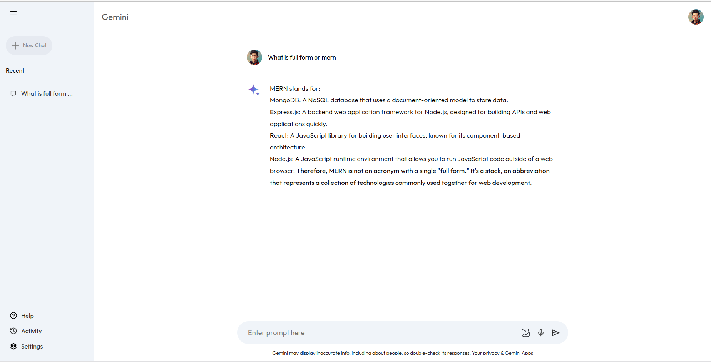

# Gemini Clone

Gemini Clone is a React-based web application that utilizes the Context API for global state management and interacts with an AI configuration service.

## Features

- Context API for managing global state
- Asynchronous interaction with an AI service
- Modular and maintainable code structure

## Getting Started

### Prerequisites

- Node.js (>=14.x)
- npm (>=6.x) or yarn

Set Your Own  #API_KEY in gemini.js file.
